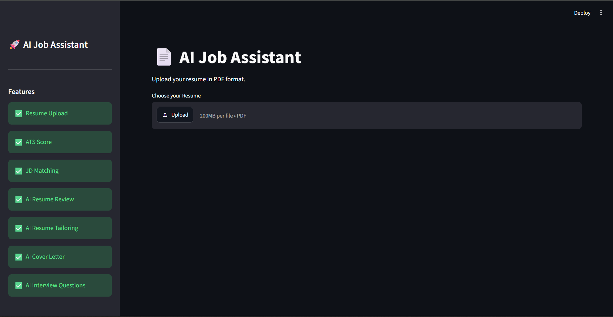
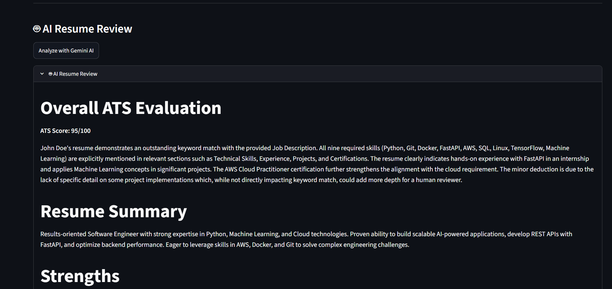
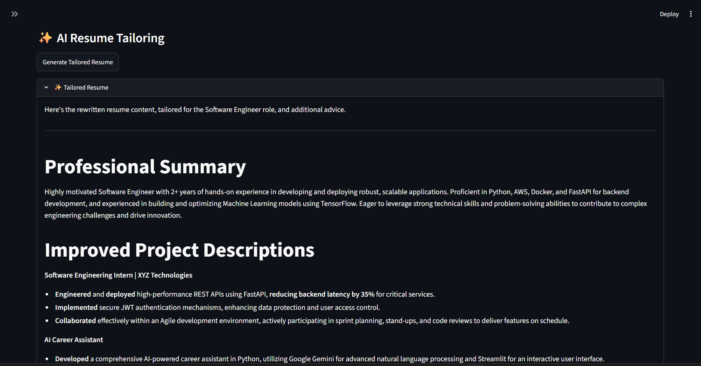
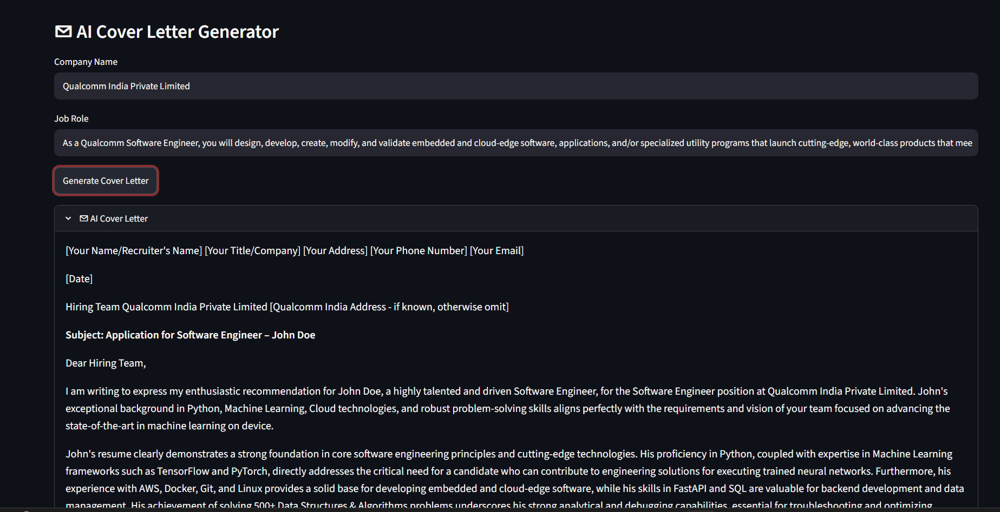
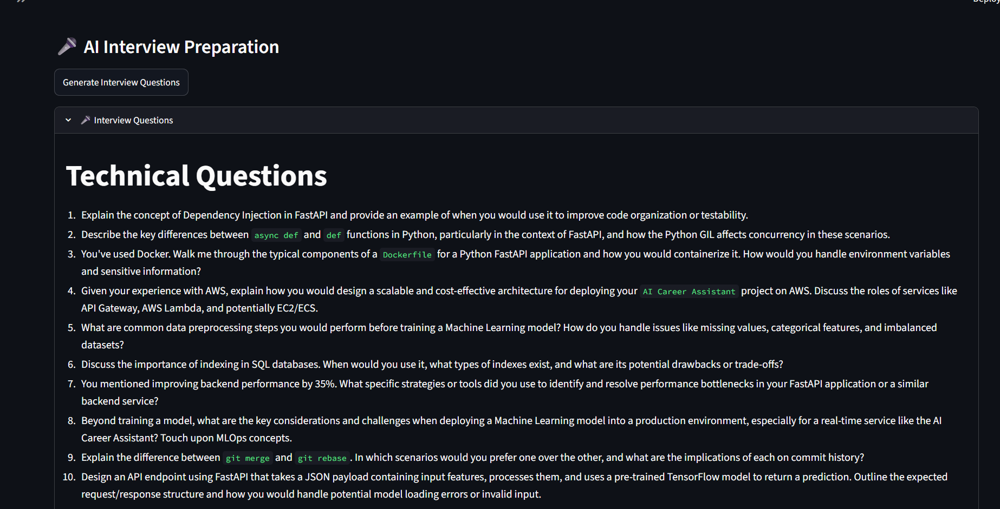

# CareerPilot

An Career Assistant built using **Python**, **Streamlit** and **Google Gemini AI** that helps job seekers optimize their resumes, tailor them to job descriptions, generate professional cover letters, prepare for interviews and download a comprehensive career report.

---

## 📌 Overview

CareerPilot is designed to simplify the job application process by providing intelligent resume analysis and personalized career guidance.

The application combines traditional ATS (Applicant Tracking System) analysis with Generative AI to deliver actionable insights for improving resumes and preparing for technical interviews.

---

## ✨ Features

### 📄 Resume Upload
- Upload resumes in PDF format
- Automatic text extraction

### 🧠 Skill Extraction
- Detects technical skills from the resume
- Highlights identified skills

### 📊 ATS Score
- Calculates resume ATS score
- Visual gauge chart using Plotly

### 🎯 Resume vs Job Description Matching
- Compares resume skills with job requirements
- Displays matching skills
- Identifies missing skills
- Calculates Job Match Percentage

### 🤖 AI Resume Review
Powered by Google Gemini AI

Provides:
- Overall ATS Evaluation
- Resume Summary
- Strengths
- Weaknesses
- Missing Skills
- Resume Improvement Suggestions

### ✨ AI Resume Tailoring
Generates:
- Improved Professional Summary
- Enhanced Project Descriptions
- ATS Keywords
- Resume Improvement Tips

### ✉ AI Cover Letter Generator
Creates personalized cover letters based on:
- Resume
- Company Name
- Job Role
- Job Description

### 🎤 AI Interview Question Generator
Generates:
- Technical Questions
- HR Questions
- Project-Based Questions
- Coding Topics to Revise
- Interview Preparation Tips

### 📄 PDF Career Report
Downloads a professional report containing:
- ATS Score
- Job Match
- AI Resume Review
- Tailored Resume
- Cover Letter
- Interview Questions

---

# 🛠 Tech Stack

### Frontend
- Streamlit

### Backend
- Python

### AI
- Google Gemini API

### Visualization
- Plotly

### PDF Processing
- pdfplumber

### Report Generation
- ReportLab

### Other Libraries
- Pandas
- python-dotenv

---

# 📂 Project Structure

```
AI-Resume-Analyzer/

│── app.py

│── requirements.txt

│── README.md

│── .gitignore

│── assets/

│── data/
│     └── skills.csv

│── utils/
│     ├── ats.py
│     ├── charts.py
│     ├── jd_score.py
│     ├── llm.py
│     ├── pdf_parser.py
│     ├── report.py
│     ├── skills.py
│     └── suggestions.py
```

---

# ⚙ Installation

## Clone Repository

```bash
git clone https://github.com/sabina-06/AI-Resume-Analyzer.git

cd AI-Resume-Analyzer
```

## Create Virtual Environment

```bash
python -m venv venv
```

### Windows

```bash
venv\Scripts\activate
```

### Linux / Mac

```bash
source venv/bin/activate
```

## Install Dependencies

```bash
pip install -r requirements.txt
```

---

# 🔑 Configure Gemini API

Create a `.env` file in the project root.

```
GEMINI_API_KEY=YOUR_API_KEY
```

**Note:** Do not upload your `.env` file to GitHub.

---

# ▶ Run Application

```bash
streamlit run app.py
```

---
## 🌐 Live Demo

https://ai-job-assistant-sabina06.streamlit.app/
# 📸 Application Preview

| Home | Dashboard |
|------|-----------|
|  |  |

| AI Review | Resume Tailoring |
|-----------|------------------|
|  |  |

| Cover Letter | Interview Questions |
|--------------|---------------------|
|  |  |

# 🚀 Future Improvements

- User Authentication
- Resume Version Management
- Multi-language Resume Support
- LinkedIn Profile Analysis
- Job Recommendation Engine
- Resume Ranking
- AI Mock Interview
- Application Tracking Dashboard

---

# 👩‍💻 Author

**Sabina Yasmin**

M.Tech (Information Technology)

National Institute of Technology Raipur

GitHub: https://github.com/sabina-06

LinkedIn: https://www.linkedin.com/in/sabinayasmin066

---

# ⭐ If you found this project useful

Please consider giving it a ⭐ on GitHub.